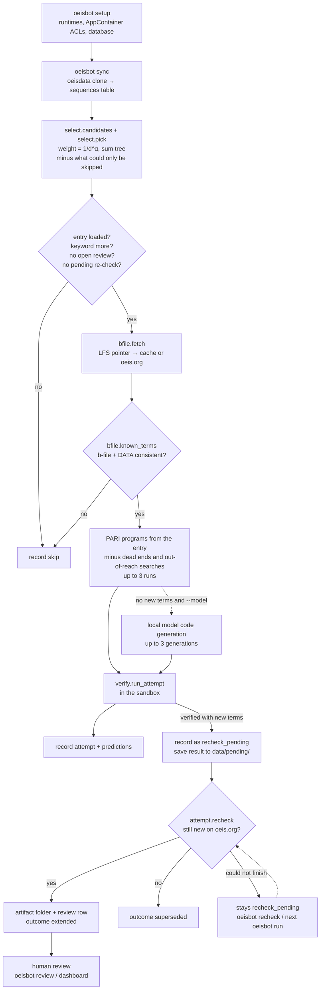

# Pipeline

This page follows one sequence from the OEIS database to a review folder, in the order the code runs.
Each stage names the function that implements it. Deeper pages:
[sandbox](sandbox.md), [verification and estimation](verification-and-estimation.md),
[strategies](strategies.md), [data and schema](data-and-schema.md).



## 0. One-time setup: `oeisbot setup`

`setup_tools.setup` prepares everything the sandbox needs. It is safe to re-run.

1. Creates `data/`, `data/bfiles/`, `data/scratch/`, `tools/`, `artifacts/`.
2. **Sandbox Python** (`install_python`): downloads `python-3.11.9-embed-amd64.zip` into
   `tools/downloads/`, extracts it to `tools/python/`, adds `Lib\site-packages` to `python311._pth`,
   installs `gmpy2` and `sympy` there (`uv pip install --target ... --link-mode copy`, or pip when uv is
   absent), then precompiles the packages with the host Python (`compileall`) because the sandbox cannot
   write `__pycache__`.
3. **PARI/GP** (`install_gp`): downloads the standalone `gp64-2-17-4.exe` to `tools/pari/gp.exe`.
   Download hashes are printed, not pinned.
4. **Sandbox identity** (`grant_access`): creates (or looks up) the AppContainer profile
   `OEISBot.Sandbox` and grants its SID inheritable read/execute on `tools/python` and `tools/pari`, and
   modify on `data/scratch` (via `icacls`).
5. Creates the SQLite database with its schema.

## 1. Sync: `oeisbot sync [--no-pull]`

`ingest.oeisdata.sync` builds the candidate table.

1. **Update the mirror** (`update`): the first run shallow-clones `https://github.com/oeis/oeisdata.git`
   into `data/oeisdata/` (`--depth 1 --single-branch`); later runs `git fetch --depth 1 origin` and
   `git reset --hard FETCH_HEAD`. On Windows git runs with `-c http.sslBackend=schannel` so it trusts the
   Windows certificate store. `--no-pull` skips this and uses the current checkout.
2. **Find candidates** (`iter_more_entries`): reads every `seq/A???/A??????.seq` file, checks the `%K`
   line, and keeps entries that have `more`, have none of `dead`, `full`, `allocated`, `recycled`,
   `dumb`, and have at least one DATA term. `fini` (a finite sequence) is not excluded: a `fini,more`
   entry is finite but still missing terms.
3. **Extract features** (`sequence_row`): name, offset (first number of `%O`), keywords, DATA term count,
   digits of the last DATA term, program languages present, the number of "more terms" credits on `%E`
   lines, and whether the name reads like a search ("smallest k such that...").
4. **Store**: difficulty is computed from those features and everything is upserted into `sequences`
   with `in_more = 1`; rows not seen this time get `in_more = 0`. The commit hash and time are written
   to `meta`.

The full sync takes about 70 seconds. The 2026-09-17 snapshot has 26,814 candidates, 186 of them
`fini,more`.

## 2. Selection: `oeisbot run -n N [--alpha A] [--seed S] [--model]`

`attempt.run_session` opens a session row, retries any pending re-checks
(`attempt.retry_pending_rechecks`, see [stage 7](#7-re-check-and-artifact-only-when-new-terms-were-found)),
then picks sequences with `select.candidates` and `select.pick`.

- **Pool.** Rows with `in_more = 1`, minus any A-number that has a review in status `new`, `reviewing`
  or `submitted`, or an attempt whose outcome is `recheck_pending`. Without `--model` the pool is limited
  to sequences whose programs include PARI (a sequence with no PARI program could only be skipped). With
  `--model` every candidate is eligible except one with no PARI program and fewer than 3 known terms
  (`config.CODEGEN_MIN_KNOWN_TERMS`, counting the larger of `bfile_terms` and `data_terms`), which the
  model stage would refuse. That exclusion applies only once the b-file lookup has run
  (`bfile_status` is `present` or `absent`), since a b-file can add terms.
- **Nothing to run.** `attempt.Runnable` then leaves out every PARI-bearing sequence that an attempt
  could only skip: it runs the attempt's own `attempt.pari_plan` (below, in
  [stage 4a](#4a-the-entrys-own-pari-programs-always-first)) and drops the sequence when no program is
  left to run, unless `--model` is on and the sequence has at least 3 known terms (the model stage would
  still take it; with fewer, the model stage would record `too_few_known_terms`, and that is the reason
  counted). Known terms are built exactly as the attempt would build them but without any request
  (`bfile.cached`: no LFS pointer means no b-file, or a cached b-file whose sha256 matches its pointer).
  Where the attempt's own gates would record a skip -- the entry missing from the mirror, a b-file that
  cannot be decided offline (not cached) or whose lookup raises, inconsistent known terms -- the sequence
  is kept and the attempt records what happens. An error the attempt has no gate for (an entry file that
  cannot be parsed, a failure inside `pari_plan`) would stop the whole session, so that sequence is left
  out instead and the first such error is shown in the session log. The log reports how many were left
  out, by the skip reason an attempt would have recorded. On the 2026-09-18 database after session 5, at
  the default 60 s verify budget and without `--model`, this left out 1,748 of the 5,316 PARI-bearing
  candidates (1,326 `no_supported_program`, 393 `verify_out_of_reach`, 29 `all_programs_dead_ends`; 12
  before session 5's 17 timeouts) in about 3 seconds; the helper check added on 2026-09-20 moves 65 more
  sequences into `no_supported_program`;
  with `--model` it left out 10, all `too_few_known_terms`. `oeisbot queue` and `oeisbot pick` apply the same check
  with the default budgets (`--all` standing for the `--model` pool); `fetch-bfiles` and the dashboard's
  Queue tab do not.
- **Difficulty.** Recomputed from the current row at pick time (so b-file facts gathered since the last
  sync count), then multiplied by a failure penalty of 2^k, capped at 64, where k is the number of earlier
  attempts on that sequence with a row whose outcome was `failed` or `verified`, each attempt (one
  `attempt_sequence` call) counted once however many programs it ran (see
  [strategies](strategies.md#failure-penalty)).
- **Weight.** `difficulty ** -alpha` (α defaults to 1; 0 is uniform).
- **Draw.** `min(N, 25)` distinct sequences, each draw proportional to weight, using a sum tree and
  setting a picked leaf's weight to zero. `--seed` makes the draw reproducible.

`oeisbot attempt A123456 ...` skips selection and runs stage 3 onward for the named sequences, outside
any session.

See [strategies](strategies.md#difficulty-and-selection) for the difficulty factors.

## 3. Per-sequence gates: `attempt.attempt_sequence`

Checked in order. Each failure records a skip row (`outcome = skipped`) and moves to the next sequence.

| Check | Skip reason recorded |
|---|---|
| `.seq` file exists in the local mirror | `not_in_oeisdata` |
| Entry still has keyword `more` in the local mirror | `no_more_keyword` |
| No open review (new/reviewing/submitted) for this A-number | `open_review` |
| No earlier win waiting for its re-check (outcome `recheck_pending`) | `recheck_pending` |
| B-file lookup did not raise | `bfile_error` |
| Known terms are consistent | `inconsistent_known_terms` |

### B-file lookup: `ingest.bfile.fetch`

1. Look for the LFS pointer `data/oeisdata/files/A123/b123456.txt` (it holds the real file's sha256 and
   size).
   - **No pointer**: the sequence has no b-file. No request is made.
   - **Pointer and a cached file whose sha256 matches**: use `data/bfiles/A123/b123456.txt`.
   - **Otherwise**: download `https://oeis.org/A123456/b123456.txt`.
2. Downloads go through `bfile.http_get`, which enforces at least 1 second between requests
   process-wide and sends the `OEISBot-triage/0.1` user agent. The exact bytes are cached so the
   sha256 can be compared with the pointer later. An HTML response raises an error, as does any HTTP
   error other than 404.
3. A 404 always writes a `b123456.absent` marker, but the marker is only consulted when there is no
   oeisdata snapshot. Without a snapshot, a cached b-file is reused with no hash check.

The result updates `sequences.bfile_status` (`present` or `absent`, or `error` when the lookup raised),
`bfile_terms`, `bfile_last_index` and `bfile_last_digits`.

### Known terms: `ingest.bfile.known_terms`

Produces a `KnownTerms` object: index → value, the offset, a source (`bfile` or `data`) and notes.

- No DATA terms → inconsistent.
- No b-file → the DATA terms, indexed from the offset.
- With a b-file, the b-file values are the base, and:
  - any index where DATA and the b-file disagree → inconsistent;
  - b-file starting later than the offset is accepted only if DATA covers the missing indices (noted);
    starting earlier → inconsistent;
  - DATA terms beyond the end of the b-file are merged in (noted);
  - any gap in the indices → inconsistent;
  - a repeated index in the b-file → inconsistent;
  - malformed b-file lines (noted): a line whose first two tokens are not integers is skipped, but a line
    with a valid index and value followed by extra non-comment text is still used as a known term.

## 4. Strategies

### 4a. The entry's own PARI programs (always first)

`strategies.pari.build_candidates` turns each `(PARI)` program in the entry into a runnable script, in
this order: `a(n)` functions, predicates such as `isok(k)`, then single print loops; within each form,
programs that appear later in the entry go first. Details: [strategies](strategies.md#parigp).

`attempt.pari_plan` sorts the candidates before anything runs; selection uses the same function (see
[stage 2](#2-selection-oeisbot-run--n-n---alpha-a---seed-s---model)). A candidate is not run when:

- **it is a dead end**: `db.is_dead_end` finds an earlier attempt with the same executed script
  (sha256) and the same number of known terms that
  - failed deterministically (`wrong_term`, `bad_index`, `protocol`, `crash`, `incomplete`); or
  - verified with no new terms and was judged `infeasible` under an extension time (`extend_wall_s`) and
    memory budget (`mem_bytes`) at least as large as the current ones (both are stored in each attempt's
    `extra`; attempts without them never count here); or
  - verified with no new terms and stopped at `extend_budget` after an extension time at least as large as
    the current one (from `extra`, as above; memory is not compared, because running out of memory never
    ends a run this way), provided the job had the CPU for at least 80% of its wall time
    (`db.EXTEND_DEAD_END_MIN_CPU_SHARE`), so a run starved by a busy machine does not count. A larger
    `--extend-s` makes the program eligible again (since 2026-09-18); or
  - stopped at `verify_timeout` after running at least the current `verify_wall_s` (its `runtime_s`).
    Keyed on the measured runtime, so attempts from before this rule count too. A larger `--verify-s`
    makes the program eligible again.
- **it is out of reach** (`pari.out_of_reach`): a predicate program's driver calls the predicate once
  for every k from its start (1, or the first known term when that is below 1) up to the last known
  term, so reproducing the known terms takes at least that many calls. When that exceeds
  `pari.PREDICATE_MAX_RATE` (2 × 10^7 calls/s, over 3 times the 5.8 × 10^6 measured for the cheapest
  predicate, a single comparison) times `verify_wall_s`, the program cannot pass and is not run. Only the
  predicate form has such a bound.

Each is logged. Up to 3 of the remaining candidates are run (`MAX_PROGRAMS_PER_SEQUENCE`), in order.

A dead end holds nothing back (since 2026-09-19, offer E; from 2026-09-18 an `infeasible` or
`extend_budget` dead end held the entry's other programs back at that budget). Within one attempt a
verified run ends the PARI stage (below), but in a later attempt at the same budget that program is
skipped as a dead end and the next one runs, with its own full extension. At a longer `--extend-s` the
first program is no longer a dead end, so it runs first again.

The loop stops early when a run found new terms (whatever the re-check decides, including
`recheck_pending`), or when a run verified every known term but produced no new terms. Only the first
also rules out the model stage.

### 4b. Local model code generation (`--model` only)

Runs only when `--model` was given, the model server answered the availability check at startup, and
no PARI run found new terms. That includes a sequence whose PARI program reproduced every known term but
produced nothing new (stopped by the extension budget or an infeasible projection, or it ended by
itself), in this attempt or in an earlier one that made it a dead end: what such a sequence needs is a
faster program, or one that keeps going. The model is then told so, and every program it writes carries
a note for the reviewer (see [strategies](strategies.md#what-the-model-is-shown)).
`strategies.codegen.generate_and_verify` asks the model to classify the sequence (and, when the known
terms strictly increase, whether it is a list of numbers with a property), then generates up to 3
programs, each run through the same path as a PARI program. For a list whose known terms strictly increase the model writes `members(work)` and a
driver numbers the members; a program identical to one that already failed in the stage in a way that
would recur there (a failure that repeats every time, or running out of the stage's verify budget) is
not run again.
Details: [strategies](strategies.md#local-model-code-generation).

- Fewer than 3 known terms (`config.CODEGEN_MIN_KNOWN_TERMS`) → skip row `too_few_known_terms` (strategy
  `python:model`), without calling the model: at least 2 known terms are always held out from it, so
  there would be nothing left to show.
- Model says `skip` → skip row `model_skip` (strategy `python:model`).
- No generation passed extraction and static checks → skip row `model_no_runnable_code`.
- Server unreachable during the run (`ModelUnavailable`) → logged, and the sequence ends as if no model
  were configured (so it may still be recorded as `no_supported_program` in stage 4c).

### 4c. Nothing ran

If no program ran (`PariPlan.nothing_to_run`):

- `verify_out_of_reach` when every candidate was out of reach, with the calls each would need;
- `all_programs_dead_ends` when at least one was a dead end (detail: "N already tried: failed the same
  way, or verified and found nothing new with no smaller budget", plus a count of any out of reach). The
  log names each one: "failed the same way before (attempt #N: mode)"; for `extend_budget` "verified
  before and found nothing new in no less time"; for `infeasible` "verified before and judged the next
  term infeasible with no less time and memory";
- otherwise `no_supported_program`, with the reasons each PARI block was rejected.

A skip row from the model stage takes precedence: with `--model` and fewer than 3 known terms, a
sequence whose PARI programs were all out of reach is recorded as `too_few_known_terms`. A sequence whose
PARI program verified and then went on to the model can also end with a model-stage skip row
(`too_few_known_terms`, `model_skip`, `model_no_runnable_code`), so `SequenceReport.skipped` is set even
though a program ran.

## 5. Running a program: `verify.run_attempt`

Every program, from either strategy, goes through the verification harness in the sandbox. In short:

- A fresh working directory `data/scratch/<A-number>-<language>-<8 hex>/` is created, and deleted after
  the run.
- The sandbox wall clock is `verify_wall_s + extend_wall_s + 30` seconds (defaults: 60 + 10,800 + 30).
- Each emitted term is checked as an (index, value) pair as it arrives, logged to
  `data/runs/<A-number>-<YYYYmmdd-HHMMSS>-<sha8>.jsonl`, and new terms are accepted only after every known
  term matched.
- After verification and after each new term, the next term's cost and memory are projected. The run
  stops before an infeasible term (on time only when the cost fit is trustworthy; on memory always), or
  kills a term running far past a trusted projection (see
  [verification](verification-and-estimation.md#assessment-estimateassess)).
- Generated Python programs are also saved next to the log as `<same stem>.py`.

Full rules: [verification and estimation](verification-and-estimation.md).

## 6. Recording: `db.record_attempt`

Every run, successful or not, writes one `attempts` row (strategy, program origin and sha, known-term
count and source, reproduced count, new-term count, runtime, CPU, peak memory, cost unit, the last
projection, outcome, stop reason, detail) and one `predictions` row per projected term. The `extra` JSON
column holds the log path, the program form, rewrite notes, the weak-verification flag, the run's
`extend_wall_s` and `mem_bytes` budgets, the attempt's key (`attempt_call`, shared by every row of one
`attempt_sequence` call) and, whenever new terms were found, the re-check note.

Outcomes: `extended` (verified with new terms, still new on oeis.org), `verified` (verified, no new
terms), `failed`, `superseded` (new terms already on oeis.org), `recheck_pending` (new terms whose
re-check has not finished), and `skipped` for gate failures.

## 7. Re-check and artifact (only when new terms were found)

A run with new terms is handled by `_Attempter.run` in this order, so that once step 1 is done, stopping
at any later point (an error, Ctrl+C, a killed process) leaves a pending win that can be resolved later
rather than a lost one:

1. **Record as pending**: the attempt row is written with outcome `recheck_pending` and
   `extra.recheck = "not done yet"`.
2. **Save the result**: the in-memory result (program, known terms, every term record, predictions,
   sandbox result), the entry name and the budgets are pickled to `data/pending/attempt-<id>.pickle`
   (written to a `.part` file, then renamed). If saving fails, that is logged and the re-check still
   runs; only a later retry would need the file.
3. **Re-check** (`attempt.recheck`): downloads the live b-file (`fetch(..., refresh=True)`, which also
   overwrites the cached copy) and the live entry in internal format
   (`https://oeis.org/search?q=id:A123456&fmt=text`), merges them, and compares against the new terms:
   - live entry not found (404), empty, unparsable, or without any terms → treated as not new, with the
     note "could not read the live entry" or "could not read any terms from the live entry";
   - a live value that differs from ours → not new, note says it DISAGREES;
   - any new index already present live → not new;
   - otherwise still new (the note mentions it if `more` has been removed from the live entry).

   `oeisbot attempt --no-recheck` skips steps 2 and 3 and treats the terms as still new, for testing.
4. **Errors** (`_recheck_with_retries`): a transient error (`TRANSIENT_ERRORS`: `OSError`, which covers
   network errors, timeouts and HTTP errors other than 404; `http.client.HTTPException`; or
   `bfile.UnexpectedResponse`, an HTML page instead of a b-file) is logged and the re-check is tried again
   after 30 s and then 120 s (`RECHECK_RETRY_WAITS_S`). Any other exception is not retried. When the
   re-check fails for good, `extra.recheck` becomes `not done: <ErrorType>: <message>`, the attempt stays
   `recheck_pending`, and the session goes on to the next sequence.
5. **Resolve** (`_resolve`):
   - **not new**: outcome `superseded`, `extra.recheck` = the note; no artifact;
   - **still new**: `artifact.write` creates `artifacts/<A-number>/attempt-<attempt id>/` with an
     `.incomplete` marker in it; `db.record_win` sets outcome `extended`, `artifact_path` and
     `extra.recheck`, and adds a `reviews` row (status `new`, first/last new index) in one transaction;
     then `artifact.mark_complete` removes the marker.

   If this step raises (for example, the artifact folder already exists), the error is logged and the
   attempt stays pending.
6. **Clean up**: the pickle is deleted. Failing to delete it is only logged; nothing reads it once the
   attempt is resolved.

### Pending re-checks: `attempt.retry_pending_rechecks`

Runs at the start of every `oeisbot run` that has pending re-checks, and on `oeisbot recheck`. For each
attempt with outcome `recheck_pending`, oldest first, it loads the saved result, runs the re-check once
(no retries) and resolves it as in step 5, then deletes the pickle. Any exception for one attempt
(unloadable or missing file, a re-check error, a failed artifact write) is logged with its type, and that
attempt stays pending; the function never raises for a single attempt, so a session always goes on to
pick sequences.

Resolving is safe to repeat. For a pending attempt, a folder that still has the `.incomplete` marker was
never recorded as a win, so `artifact.write` deletes and rewrites it; an existing folder without the marker is never
overwritten (the attempt then stays pending, with a `FileExistsError` in the log). The attempt row keeps its
original session and timestamps, and `verification.md` shows the note of the re-check that actually
ran.

The folder contents are described in [data and schema](data-and-schema.md#artifact-folders).

## 8. Session end: `db.finish_session`

Always runs, even if the session is interrupted by an exception. It sets `finished_at`, `attempts` (all
attempt rows in the session, skips included), `wins` (rows with outcome `extended`) and `machine_s`
(sum of runtimes). A win still `recheck_pending` when the session ends is not counted, and is not added
later when its re-check succeeds.

## 9. Human review

Nothing leaves the machine. The review queue is read with `oeisbot review list` or the dashboard's
Review inbox, and its status is changed only from the command line:

```
oeisbot review set <review id> reviewing|submitted|rejected [--note "..."]
```

Marking a second review for the same A-number as `submitted` is refused. While a review is `new`,
`reviewing` or `submitted`, that sequence is never picked or attempted again. The same holds while a
win for it is `recheck_pending`. The review workflow is in
[operations](operations.md#reviewing-a-result).
